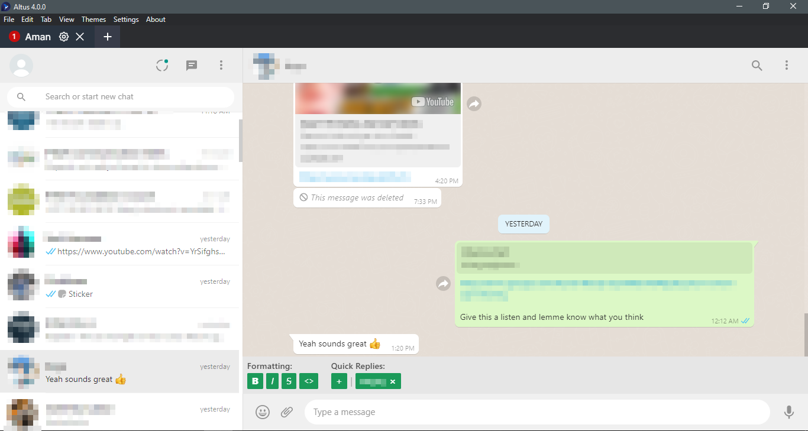

# Altus

   

**Altus** is an Electron-based WhatsApp client with themes and multiple account support, available for Windows, Mac and Linux!

## Features

**Altus** uses the GitHub-produced Electron framework to wrap around WhatsApp Web and add extra features to it.

- **Multiple Account Support**: As of v2.0, you can use multiple WhatsApp accounts simultaneously!
- **Native notification support** for all of the platforms. Clicking the notification opens that specific chat!
- **Online Indicator**: Shows an indicator at the bottom-left corner of the chats that are online!
- **Dark mode** for when you need to chill out your eyes in the night (or even in the day)
- **Custom Theme Support**: Write your own CSS theme for WhatsApp or use the in-built Theme Customizer to create a new one just by picking colors!
- **Available for most desktop platforms** including Windows (7 or above), Linux and MacOS.
- **Tray icon** so you can minimize the app completely and still receive notifications.

## Feature Requests

In order to submit a feature request, create a [new issue](https://github.com/amanharwara/altus/issues/new) with the label `enhancement`.

Please make sure that you provide a helpful description of your feature request. If possible, try implementing the feature yourself by forking this repository and then creating a pull request.

## Screenshots

### First Start

### Default WhatsApp Theme

### Dark WhatsApp Theme

## Support

If you like Altus, consider supporting it by donating using any of the following methods:

- LiberaPay: 
- Ko-Fi: 

## Acknowledgements

Below is the list of the dependencies that helped me greatly to create this app.

#### Onyx [(vednoc/onyx)](https://github.com/vednoc/onyx) - used as the base for the dark theme. A really cool project, you should definitely check it out!

---

#### Tabby [(cferdinandi/tabby)](https://github.com/cferdinandi/tabby) - used to implement the tabs system.

---

#### SweetAlert2 [(https://sweetalert2.github.io/)](https://sweetalert2.github.io/) - used to implement pop-ups.

---

#### Manrope [https://manropefont.com/](https://manropefont.com/) - The font used in Altus.

---

#### pickr [(Simonwep/pickr)](https://github.com/Simonwep/pickr) - used to implement color pickers.

---

#### custom-electron-titlebar [(AlexTorresSk/custom-electron-titlebar)](https://github.com/AlexTorresSk/custom-electron-titlebar) - used to create a custom titlebar instead of the plain titlebar that Electron has by default

---

#### electron-store [(sindresorhus/electron-store)](https://github.com/sindresorhus/electron-store) - used to store information of settings, tabs and themes

## Contributors

Below is the list of contributors who have contributed to Altus by creating a feature or helping fix an issue.

#### [Melvin-Abraham](https://github.com/Melvin-Abraham) - Helped fix issues #55, #53

#### [dylanmcdougall](https://github.com/dylanmcdougall) - PR #10 (Added feature - Confirmation Dialog on close)

#### [Dafnik](https://github.com/Dafnik) - PR #5 (Helped fix issue #4)

#### [Marcelo Zapatta](https://github.com/MarceloZapatta) - PR #77 (Fixed #23 by adding tray icon support on Linux)
