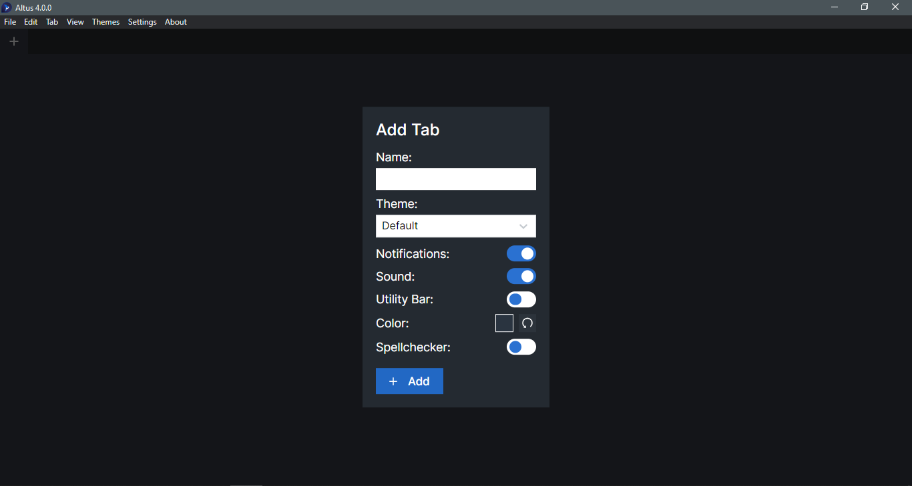
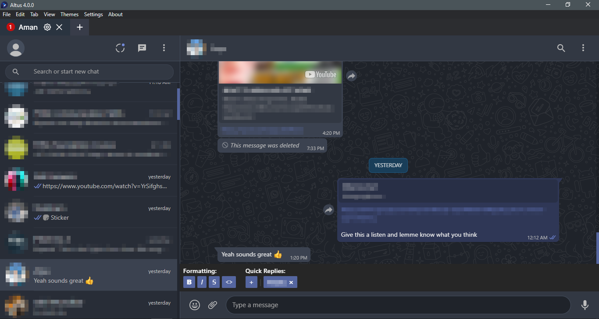

# Altus

   

**Altus** is an Electron-based WhatsApp client with themes and multiple account support, available for Windows, Mac and Linux!

The name **Altus** comes from the Latin adjective _altus_ meaning "high, deep, noble or profound". The name was actually suggested by one of my friends.

## Features

**Altus** uses the GitHub-produced Electron framework to wrap around WhatsApp Web and add extra features to it.

- **Multiple Account Support**: As of v2.0, you can use multiple WhatsApp accounts simultaneously!
- **Native notification support** for all of the platforms.
- **Dark mode** for when you need to chill out your eyes in the night (or even in the day)
- **Custom Theme Support**: Write your own CSS theme for WhatsApp or use the in-built Theme Customizer to create a new one just by picking colors!
- **Available for most desktop platforms** including Windows (7 or above), Linux and MacOS.
- **Tray icon** so you can minimize the app completely and still receive notifications.

## Feature Requests
In order to submit a feature request, create a [new issue](https://github.com/ShadyThGod/altus/issues/new) with the label `enhancement`.

Please make sure that you provide a helpful description of your feature request. If possible, try implementing the feature yourself by forking this repository and then creating a pull request.

## Screenshots

### First Start

### Default WhatsApp Theme

### Dark WhatsApp Theme

### Custom WhatsApp Theme Example

## Releases

To download the latest releases, you can [click here](https://github.com/ShadyThGod/altus/#latest-releases). Alternatively, you can visit the [releases page](https://github.com/ShadyThGod/altus/releases) on the repository.

---

### Installation :-

#### Windows

- Run the `.exe` file provided in the release. E.g.: `Altus-Setup-3.0.0.exe`
- If Windows displays a warning saying **'Windows protected your PC'**, click on **More info** and then click **Run Anyway**
- Once the Altus Setup starts, you will be asked to select from two choices which are **Anyone who uses this computer (all users)** and **Only for me (username)**. Select one according to your choice.
- Choose the destination folder where you want Altus to be installed. The default folder depends on what option you chose previously.
  - If you chose "_Anyone who uses this computer_", then the default folder will be `C:\Program Files\Altus` which you can change if you want.
  - If you chose "_Only for me_", then the default folder will be `C:\Users\Username\AppData\Local\Programs\Altus` which you can change if you want.
- Click **Install**. If it asks for admin privileges (UAC), click **Yes**
- The installation will Altus will be installed to the path according to what you selected. You can select **Run Altus** if you want to start Altus after closing the setup.

#### Linux

I recommend using the `.AppImage` format since it allows you to use that single executable on the majority of Linux distributions. I am also not going to create `.deb` executables anymore since they aren't universal and are proprietary to Debian distributions unlike `.AppImage` executables which work on almost all of the distributions.

Installing Altus on Linux using AppImage is really easy. Follow these steps:

- Download and move the AppImage file to wherever you want to. E.g: `~/Downloads/Altus 3.0.0.AppImage`
- You might need to make the file executable using chmod. Use: `chmod a+x ~/Downloads/Altus 3.0.0.AppImage`
- Then simply run it. Use: `~/Downloads/Altus 3.0.0.AppImage`

#### Mac

One thing to note is that Mac releases most probably will be late than the Windows and Linux releases as I do not own a Mac and my PC runs really slow when I use macOS on a VM.

To install Altus on a Mac, follow these steps:

- Download the `.dmg` file
- Double-click it i.e. run it
- Drag the **Altus icon** onto the **Applications folder**
- Let it copy
- Done!

---

### Latest Releases:

#### Windows - v3.4.0 - [Download](https://github.com/ShadyThGod/altus/releases/download/3.4.0/Altus-Setup-3.4.0.exe)

#### Linux - v3.4.0 - [Download](https://github.com/ShadyThGod/altus/releases/download/3.4.0/Altus.3.4.0.AppImage)

#### MacOS - v3.4.0 - [Download](https://github.com/ShadyThGod/altus/releases/download/3.4.0/Altus-3.4.0.dmg)

## For Developers

Altus is an open-source app and I really appreciate other developers adding new features and/or helping fix bugs. If you want to contribute to Altus, you can fork this repository, make the changes and create a pull request. You can check out [this tutorial](https://help.github.com/en/articles/creating-a-pull-request-from-a-fork) to learn how to create a pull request.

However, please make sure you follow a few rules listed below to ensure that your changes get merged into the main repo. The rules listed below are enforced to make sure the changes made are well-documented and can be easily kept track of.

- Make sure your pull request has a informative title. You should use prefixes like `ADD:`, `FIX:`, etc at the start of the title which describe the changes followed by a one-line description of the changes. Example: `ADD: Added a new feature to Altus`

- Your pull request's description should be in-depth. Make sure you document all the changes you made as in-depth and informative as possible. Dependency changes and major code changes must be thoroughly described and given priority in your description.

- Commits in your fork should be informative, as well. Make sure you don't combine too many changes into a single commit.

## Acknowledgements

Below is the list of the dependencies that helped me greatly to create this app.

#### Onyx [(vednoc/onyx)](https://github.com/vednoc/onyx) - used as the base for the dark theme. A really cool project, you should definitely check it out!

---

#### Tabby [(cferdinandi/tabby)](https://github.com/cferdinandi/tabby) - used to implement the tabs system.

---

#### SweetAlert2 [(https://sweetalert2.github.io/)](https://sweetalert2.github.io/) - used to implement pop-ups.

---

#### pickr [(Simonwep/pickr)](https://github.com/Simonwep/pickr) - used to implement color pickers.

---

#### custom-electron-titlebar [(AlexTorresSk/custom-electron-titlebar)](https://github.com/AlexTorresSk/custom-electron-titlebar) - used to create a custom titlebar instead of the plain titlebar that Electron has by default

---

#### electron-store [(sindresorhus/electron-store)](https://github.com/sindresorhus/electron-store) - used to store information of settings, tabs and themes

## Contributors

Below is the list of contributors who have contributed to Altus by creating a feature or helping fix an issue.

#### [dylanmcdougall](https://github.com/dylanmcdougall) - PR #10 (Added feature - Confirmation Dialog on close)
#### [Dafnik](https://github.com/Dafnik) - PR #5 (Helped fix issue #4)
